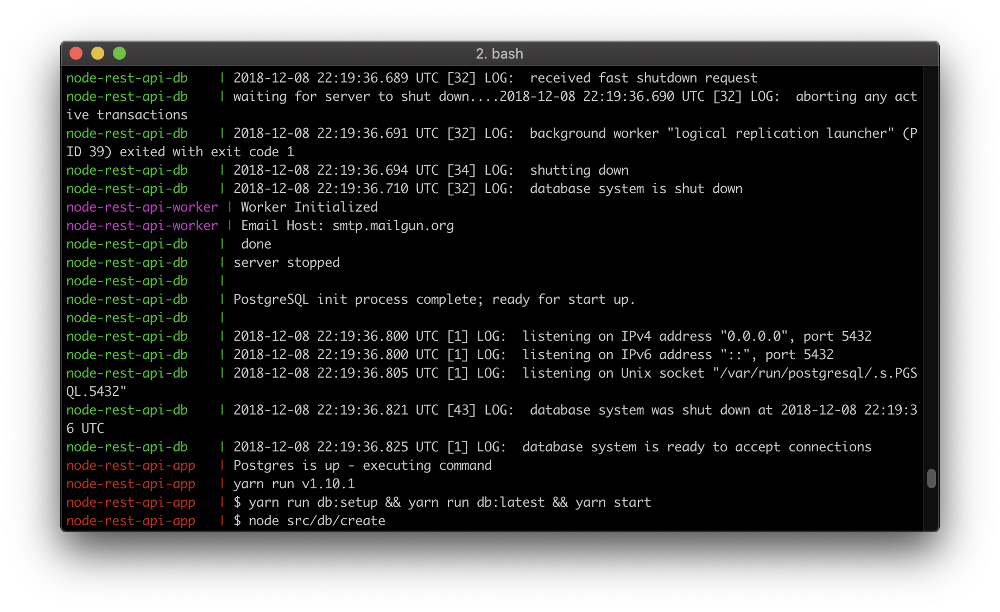

# Node.js Authentication API Server boilerplate
A boilerplate of RESTful API server that provides ability to Register, Login, and lookup user profile. It enables uses of JWT-based for authentication and verification.
<p align="center">
  
</p>

## Features
- [koa2](http://koajs.com) - An expressive async and middleware web framework for Node.js
- [knex.js](http://knexjs.org) - A "batteries included" SQL query builder and migration
- [Objection.js]() - An SQL-friendly ORM for Node.js, built on an knex query builder
- [ObjectModel](http://objectmodel.js.org/) - A delightful JS testing framework
- [Bull](https://github.com/OptimalBits/bull) - A background job queue for Node.js
- [Jest](https://facebook.github.io/jest/) - don't let tests get in your way
- [supertest](https://github.com/visionmedia/supertest) - HTTP integration assertions tests
- [eslint](https://eslint.org/) - The pluggable linting utility for JavaScript
- [standardjs](https://standardjs.com/) - just don't worry about formatting rules
- [JWT-based Authentication](https://jwt.io/) - JSON Web Tokens authentication
- [NodeMailer](https://nodemailer.com/about/) - A email client library for Node.js
- [UPASH](https://github.com/simonepri/upash) Unified API for PASsword Hashing algorithms

<p align="center">
  <sub>
    Coded with ❤️ by <a href="#authors">Jason Yeh</a>.
  </sub>
</p>

## Prerequiesis

* Node.JS 10+ LTS
* PostgreSQL 9 or higher (or available via Docker container)
* Yarn

Make sure you have postgreSQL Database configured

## Getting Started
Firstly, you need to install this package.
```bash
yarn
```
Add some configuration setup via `.env` file:
```bash
SMTP_HOST=smtp.mailgun.org
SMTP_USER=postmaster@XXXXXXXXXXX.mailgun.org
SMTP_PASS=XXXXXXXXXXX
PGHOST=localhost
PGPORT=5432,
PGUSER=postgres
PGPASSWORD=XXXXXX
PGDATABASE=api-dev
```
Make sure you don't forget create database (default to `api-dev`) into PostgreSQL DB.
```bash
yarn start
```
Or, you can run the script to create database and migrate automatically.
```bash
yarn run server:init
```

The API is available at [http://localhost:3000](http://localhost:3000).

## Running with Docker

1. Setup Environment

Write up SMTP configuration setup to the `.env` file on root of the directory:

```bash
SMTP_HOST=smtp.mailgun.org
SMTP_USER=postmaster@XXXXXXXXXXX.mailgun.org
SMTP_PASS=XXXXXXXXXXX
```

2. Start up the docker composer

```
  docker-compose up (compose and run, it also creates the redis and postgres database)

  docker-compose down (Destroy application and postgres containers)
```

3. Open up browser

* [http://localhost:8080](http://localhost:8080) - A client-side Web Application
* [http://localhost:3000](http://localhost:3000) - A server-side API Server

# Notes
